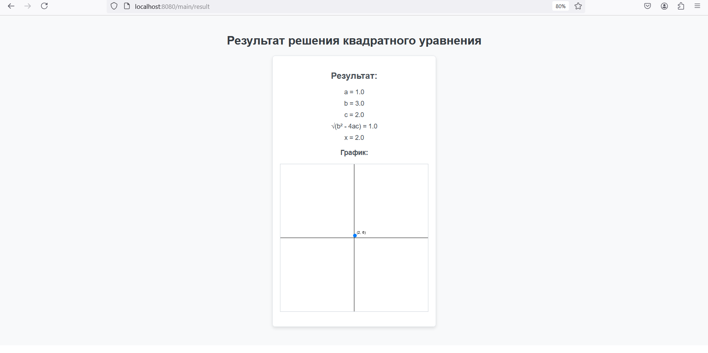

# Приложение CalculateX

## Описание

**CalculateX** — это веб-приложение на основе Spring Boot, которое позволяет пользователям рассчитывать корни (X) квадратного уравнения с использованием метода дискриминанта. Приложение предоставляет простой веб-интерфейс для ввода коэффициентов уравнения и отображения результатов расчета.

## Установка и запуск

### Предварительные требования

Перед запуском убедитесь, что у вас установлены следующие компоненты:

- **Java 17** или выше
- **Maven** для сборки проекта 

### Шаги для запуска

1. **Клонируйте репозиторий:**

   ```bash
   git clone https://github.com/krr006/test_task.git
   cd test_task
   ```
   
2. **Сборка и запуск приложения:**
   
   ```bash
   mvn clean package
   mvn spring-boot:run
   ```

3. **Откройте приложение в браузере:**

   После успешного запуска приложения, откройте браузер и перейдите по адресу:
   
   ```bash
   http://localhost:8080/main/calculate
   ```
   
### Использование

1. Введите коэффициенты `a`, `b`, и `c` для вашего квадратного уравнения в форму на главной странице и нажмите "Рассчитать", чтобы получить `x`:
   

2. Далее, Вы можете ввести значение `y` и просмотреть результат с графиком на следующей странице:
   

3. Полученный результат:
   

### Структура проекта

   1. `CalculateController`: Контроллер, который обрабатывает HTTP-запросы и взаимодействует с моделью и представлениями.
   2. `CalculateService`: Сервис, который содержит логику для расчета дискриминанта и корней.
   3. Шаблоны Thymeleaf: Используются для отображения форм и результатов на веб-страницах.

### Исключения

   Если коэффициент `a` равен нулю, или если дискриминант отрицательный, приложение выбросит исключение с соответствующим сообщением об ошибке.